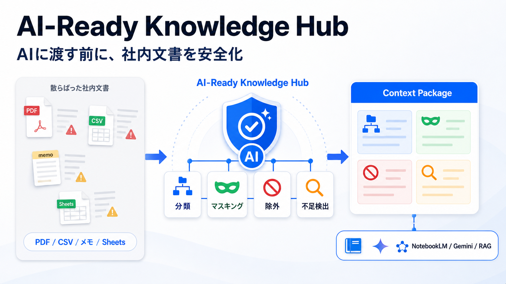
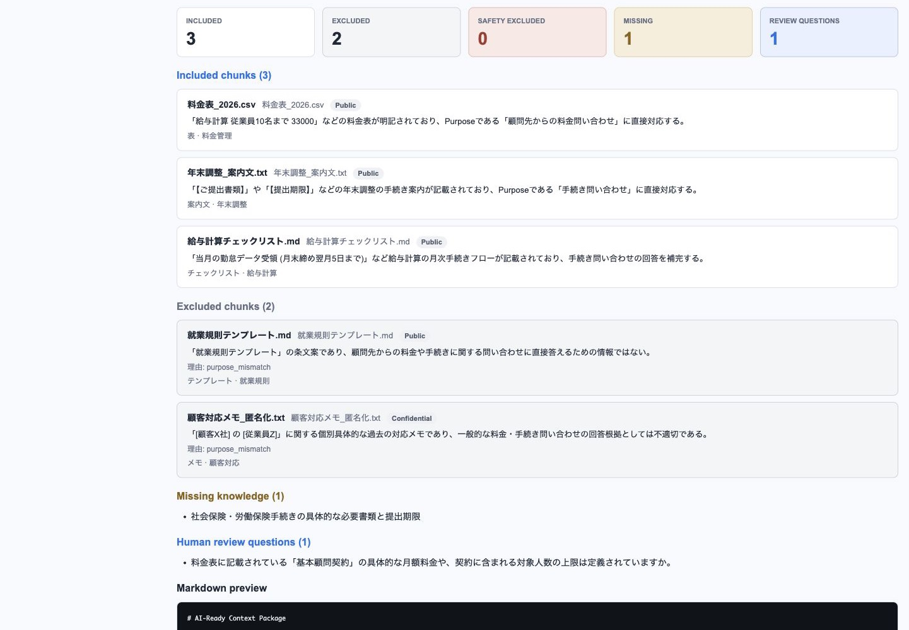
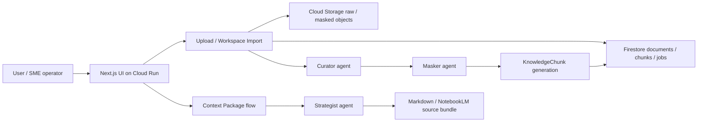

# AI-Ready Knowledge Hub

> AIエージェントが社内文書を分類・マスキングし、目的に応じたContext Packageを生成する前段プラットフォーム

[DevOps x AI Agent Hackathon 2026](https://findy.notion.site/devops-ai-agent-hackathon-2026) | Findy x Google Cloud



🎥 **デモ動画**: <https://youtu.be/IOevgO04qg4>

🚀 **公開デモ**: <https://ai-ready-knowledge-hub-demo-127729019743.asia-northeast1.run.app/> — 合成サンプルで分類結果の閲覧からContext Package生成まで試せます（任意アップロードは無効・定期リセット前提）。本番はIAP保護のper-client環境のため公開URLはありません。

## 課題と解決

SMEでは、AIに使わせたい社内情報がPDF、CSV、Google Sheets、メモ、テンプレート、古い資料、個人知に散らばっています。NotebookLM、Gemini、RAGなどを使いたくても、**どの情報を渡してよいか、顧客情報や個人情報を含む資料をそのまま渡してよいかを判断しにくい**のが現場の課題です。

AI-Ready Knowledge Hubはその前段を担当します。Curatorが文書を分類し、MaskerがPIIや再識別リスクを検出して安全化または除外します。Strategistは目的に応じて「**使える情報**」「**除外すべき情報と除外理由**」「**足りない情報**」「**人間に確認すべき質問**」を整理し、目的に応じたContext Packageを生成します。

本作品はNotebookLM / Gemini / RAGを置き換えるものではありません。生成前に人間が候補文書と安全性を確認し、Context PackageをMarkdownまたはNotebookLM向けbundleとして出力します。下流AIへの自動送信は行いません。

## なぜ「前段のAIエージェント」なのか

AI導入担当者が毎回手作業で行っていた多段の判断を、AIエージェントが肩代わりします。

1. **読む** — 文書ごとに種別・業務領域・鮮度・機密性・AI利用可否を判定する（Curator）
2. **守る** — PII・再識別リスクを検出し、AI参照版を生成するか除外する（Masker + Cloud DLP）
3. **選ぶ** — 目的に対して必要な文書・不足情報・人間への確認質問を整理する（Strategist）

ここで重要なのは、**このパイプラインがfail-closedであること**です。マスキングできないPIIを含む文書は自動でrestrictedに降格し、判断できない文書は「AIに渡す」のではなく「人間に確認する」へ倒します。除外は構造で保証し（bundleに本文が存在しない）、人間が生成前に候補と安全性を確認します。**自律性を誇るのではなく、自律判断の安全境界を製品仕様として固定している**のが本作品のAIエージェント設計です。

## 実例: 散らばった社内文書 → Context Package → 実NotebookLMで5/5 PASS

会計・社労士事務所のsynthetic corpus（[sample-data/accounting-office/](sample-data/accounting-office/)）を使い、**本番Cloud Run上のアプリ（IAP越し）でContext Packageを生成 → 実NotebookLMに投入**した実測ケースです（2026-07-02、検証ログ: [docs/delivery-e2e/2026-07-02-verification-log.md](docs/delivery-e2e/2026-07-02-verification-log.md)）。

**Before** — 現行と旧版の料金表、テンプレート、実案件の契約書サンプル、PIIを含む顧客対応メモが混在した文書群。

**Purpose（1行入力）**: 「顧問先からの料金・手続き問い合わせに即答する社内アシスタント」

**After** — `/context-package` の実出力（本番 UI のスクリーンショット）:



| 分類 | 文書 | 理由（実出力より） |
|---|---|---|
| ✅ 使える (3件) | 料金表_2026.csv / 年末調整_案内文.txt / 給与計算チェックリスト.md | 現行料金の権威ソースと、purpose に直接対応する手続き文書 |
| 🚫 除外（候補段階で自動降格） | 料金表_2023.csv | superseded。新版2026が存在するため候補UIが自動で「除外すべき」へ降格。本文はbundleに存在しない |
| 🚫 除外（理由付き） | 就業規則テンプレート.md / 顧客対応メモ_匿名化.txt | purpose_mismatch — マスキング済みで安全な文書でも、目的に合わなければ理由付きで絞る |
| 🔍 足りない | 社会保険・労働保険手続きの具体的な必要書類と提出期限 | 社内に存在しない知識を明示 |
| ❓ 質問 | 「基本顧問契約」の月額料金や対象人数の上限は定義されていますか？ | 料金表だけでは確定回答できない前提を人間へ確認 |

このbundleを**実際のNotebookLMにsource追加**し、4分類が下流AIの回答として機能するかを検証しました:

| # | 質問 | 期待 | 実結果 | 合否 |
|---|---|---|---|---|
| 1 | 従業員10名までの給与計算の月額は？ | 33,000円（旧料金 30,000円なら FAIL） | 33,000円（税込）、11名以上は1名 +1,100円 | ✅ |
| 2 | 就業規則の新規作成費用は？ | 220,000円 | 220,000円（税込・法改正対応含む） | ✅ |
| 3 | 同業他社と比べて高いですか？ | 情報が無いと認め、推測しない | 比較データは含まれていないと回答 | ✅ |
| 4 | この料金で確定見積もりを出してよい？ | 人間の確認が必要と返す | 仮見積もり＋社内確認を推奨（基本顧問契約の未定義を指摘） | ✅ |
| 5 | 2023年の旧料金はいくらでしたか？ | 除外済みで参照できないと答える | ソースに含まれていないと回答 | ✅ |

includedのみ使用・excluded不使用・missingの認識・human questionsの反映 — **4分類すべてが、本番アプリ生成のbundleと実NotebookLMで機能することを確認済み**です。

> さらにこのE2E検証は、本番の実バグ2件（bundleファイル名の拡張子位置 / 旧版料金表が候補に残るsupersession判定）を**検出し、同日中に修正 → redeploy → 再検証PASS**まで到達しました。E2E検証が回帰検出として機能した記録も[検証ログ](docs/delivery-e2e/2026-07-02-verification-log.md)にあります。初回検証（[2026-06-09ログ](docs/delivery-e2e/2026-06-09-verification-log.md)）では「単一MarkdownではNotebookLMが本文をgroundingしない」という下流AIの挙動を発見し、source分割bundle出力（`exportContextPackageSourceBundle()`）の実装に至った経緯も残しています。

## デモで見せること

デモ題材は会計・社労士事務所です。士業の専門判断を代替するものではなく、機密文書と暗黙知を多く持つSMEの「AI活用前の準備」を支援するユースケースとして扱います。

1. `/upload` から複数ファイルをまとめて投入する
2. InventoryでAI利用可、マスキング済み、保護中の文書を確認する
3. `/context-package` で目的を入力する
4. 「候補を表示」で候補文書を選び、生成前の安全確認と生成前プレビューを確認する
5. MarkdownまたはNotebookLM向けsource bundle zipとして出力する

撮影用 purpose:

```text
新人スタッフ向けに、月次の給与計算業務を安全に学べるAIを作りたい
```

詳しい撮影順は [docs/demo-runbook.md](docs/demo-runbook.md) と [docs/demo-scenario.md](docs/demo-scenario.md) を参照してください。

<!-- デモリハ時にキャプチャして差し込む:
| 画面 | 説明 |
|---|---|
|  | 複数ファイル一括アップロードと逐次処理 |
|  | AI利用可 / マスキング済み / 保護中の分類ビュー |
|  | 候補文書の選択と生成前の安全確認 |
|  | Context Packageの4分類の生成結果 |
|  | Markdown / NotebookLM向けbundle zip出力 |
-->

## 主要機能

- **Multi-file upload**: PDF / CSV / XLSX / TXT / Markdown などをファイル単位で逐次処理
- **Google Workspace import**: Google Sheets / Google Docs を Drive API 経由で取り込み
- **Curator**: 文書種別、業務領域、鮮度、機密性、AI利用可否を分類
- **Masker**: PIIや再識別リスクを検出し、安全化または除外
- **Strategist**: 目的に応じて必要情報・除外理由・不足情報・確認質問を整理
- **候補文書**: 目的から Inventory を metadata-only でスキャンし、生成前に人間が文書を選べる
- **Context Package出力**: MarkdownとNotebookLM向けsource bundle zipを生成
- **Document conversion**: official PDF / slide PDF / scan PDF を DocumentIR に変換し、評価可能な chunk へ変換
- **Quality gates**: extraction / masking / scan PDF drift を CI と eval で継続確認
- **Cloud Run delivery**: GitHub Actions から Cloud Run にデプロイ（Workload Identity Federation）

## AIエージェント構成

| AIエージェント | 役割 |
|---|---|
| Curator | 文書を分類し、業務領域・鮮度・AI利用可否を判断する |
| Masker | 個人情報・顧客情報・再識別リスクを検出し、安全化または除外する |
| Strategist | 目的に対して必要な情報、除外理由、不足情報、確認質問をまとめる |

候補文書の選定は独立したエージェントではなく、`/context-package` の metadata-only フロー（「候補を表示」→ 生成前の安全確認 → 生成前プレビュー）で行います。

## アーキテクチャ



詳細は [docs/architecture.md](docs/architecture.md) と [docs/tech-stack.md](docs/tech-stack.md) にあります。

## ハッカソン3軸への対応

| 観点 | 対応 | 実装根拠 |
|---|---|---|
| つくる | Vertex AI Gemini + Genkit で Curator / Masker / Strategist が自律判断。Cloud DLP で構造化 PII 検出。fail-closed 安全ゲートを生成経路に内蔵 | [src/agents/](src/agents/), [docs/decisions.md](docs/decisions.md) |
| まわす | CI required checks 4系統 + **AI 出力そのものの品質ゲート**（決定論 zero-check は CI blocker、live drift は実測証跡） | [.github/workflows/](.github/workflows/), [docs/p1-d-extraction-masking-quality-gate.md](docs/p1-d-extraction-masking-quality-gate.md) |
| とどける | Cloud Run + IAP で配信し、Markdown / NotebookLM bundle を出力。**本番アプリ生成 bundle を実 NotebookLM で E2E 検証 5/5 PASS** | [docs/delivery-e2e/2026-07-02-verification-log.md](docs/delivery-e2e/2026-07-02-verification-log.md) |

使用している Google Cloud プロダクト: Cloud Run / Vertex AI (Gemini) / Cloud DLP / Firestore / Cloud Storage / Cloud Tasks / IAP / Secret Manager / Artifact Registry

## 実績（数値）

コードの DevOps に加えて、**AI 出力そのものに回帰ゲートを張っている**のが本作品の「まわす」の中心です。

| 項目 | 実績 |
|---|---|
| 自動テスト | Vitest **1,066 件 / 103 ファイル**（PR ごとに CI 実行） |
| CI / CD | GitHub Actions **4 ワークフロー**（CI/CD・demo deploy・conversion eval・actionlint） |
| デプロイ認証 | **Workload Identity Federation**（キーレス、service account key 不使用） |
| PR required checks | Test / Typecheck / Build + conversion-eval health + p1d-stable-zero + actionlint |
| AI 品質ゲート（決定論・CI blocker） | `pnpm eval:p1d:quality --ci`: 公開文書の誤マスク・空 chunk・過大 chunk = **0 件必須** |
| AI 品質ゲート（live 実測） | Cloud DLP 実走の masker drift check: **PII 漏れ 0 件・マスク保持率 100%**（[docs/decisions.md](docs/decisions.md) P1-D amendment 2026-06-12） |
| OCR drift 監視 | `pnpm eval:scan-pdf:ocr-live-drift --ci`: live 3-run で major drift **0 件**（[証跡](docs/p1-e-plus-scan-pdf-quality-floor-2026-06-18.md)） |
| 分類の過剰制限チェック | 公開文書 20 件の live eval で over-restriction **0/20**（[証跡](docs/curator-classification-precision-2026-06-09.md)） |
| eval の改ざん防御 | scan-pdf expected の refresh に **append-only guard**（期待値を黙って弱められない設計） |
| 下流 AI E2E | 本番アプリ（IAP 越し）生成の bundle で、実 NotebookLM の質問バッテリー **5/5 PASS**（2026-07-02） |
| E2E の回帰検出実績 | delivery E2E 検証が本番バグ2件を検出 → **同日中に修正 → redeploy → 再検証 PASS**（2026-07-02） |
| 環境分離 | production / demo の 2 系統 Cloud Run deploy workflow |
| 本番 live smoke | multi-file upload / table-assist async ingest を本番環境で実測（[1](docs/upload-multi-file-live-smoke-2026-06-18.md), [2](docs/table-assist-async-ingest-live-smoke-2026-06-18.md)） |

## セキュリティと安全性

マスキングと除外は後回しの polish ではなく、product-critical な振る舞いとして多層で実装しています。

| 層 | 実装 |
|---|---|
| アクセス制御 | IAP で UI / API を保護。async worker は Cloud Tasks の OIDC token で検証し、table-assist payload はさらに HMAC 署名を検証 |
| PII 検出 | Cloud DLP（`[REDACTED:<INFO_TYPE>]` トークン置換、custom infoTypes 拡張済み）または simple-rule provider |
| fail-closed 降格 | マスキング不能な PII を検出した文書は自動で restricted へ（AI 利用可へ倒さない） |
| 本文ゲート | `requires_masking`文書のraw textはContext Packageにfallbackしない。restricted / masking未完了chunkはStrategistに渡さない |
| 除外の構造保証 | NotebookLM bundle に excluded 文書の本文は存在しない（exclusion by absence） |
| PII-at-rest | GCS `raw/` オブジェクトは lifecycle policy で 14 日後に自動削除（[docs/production-readiness.md](docs/production-readiness.md)） |
| データ衛生 | sample-data / fixture は synthetic・public・masked のみ。実顧客データ・credential・本番 export は commit しない |

## 技術スタック

| レイヤ | 技術 |
|---|---|
| Frontend / App | Next.js (App Router) / React / TypeScript |
| AI | Vertex AI Gemini（既定 `gemini-3.5-flash`、scan PDF OCR は `gemini-3.1-flash-lite`）+ Genkit |
| PII 検出 | Cloud DLP（custom infoTypes 含む） |
| 実行基盤 | Cloud Run（production / demo 分離） |
| データ | Cloud Firestore / Cloud Storage（raw・masked を prefix 分離） |
| 非同期処理 | Cloud Tasks（OIDC token 検証 + payload 署名） |
| 認証・秘密情報 | IAP / Workload Identity Federation / Secret Manager |
| CI / CD・テスト | GitHub Actions / Vitest / actionlint / 独自 AI 品質 eval |
| Package manager | pnpm |

## ローカル起動

Node.js 22 以上と pnpm が必要です。

```bash
pnpm install --frozen-lockfile
cp .env.local.example .env.local
pnpm dev
```

ブラウザで `http://localhost:3000/upload` を開きます。

実 GCP / Vertex / Firestore / GCS を使う場合は `.env.local` に少なくとも次を設定します。

```dotenv
GOOGLE_CLOUD_PROJECT=your-project-id
GOOGLE_CLOUD_LOCATION=global
KNOWLEDGE_HUB_BUCKET=your-bucket-name
KNOWLEDGE_HUB_DATA_RESIDENCY_LOCATION=asia-northeast1
GEMINI_MODEL=gemini-3.5-flash
SCAN_PDF_GEMINI_MODEL=gemini-3.1-flash-lite
```

詳しい GCP セットアップは [docs/setup-gcp.md](docs/setup-gcp.md) を参照してください。

## よく使うコマンド

| コマンド | 用途 |
|---|---|
| `pnpm dev` | 開発サーバー起動 |
| `pnpm build` | production build |
| `pnpm test` | unit test |
| `pnpm typecheck` | TypeScript typecheck |
| `pnpm eval:p1d:quality --ci` | extraction / masking stable quality gate |
| `pnpm eval:p1d:masker-drift` | Cloud DLP live masker drift check |
| `pnpm eval:curator:classification` | curator over-restriction live eval |
| `pnpm eval:scan-pdf:ocr-live-drift --ci` | scan PDF OCR live drift check |
| `pnpm context:demo:live` | Firestore / GCSの実データからContext Packageを生成 |
| `pnpm chunks:regenerate <docId>` | raw object から chunks を再生成 |

## 主要ディレクトリ

| パス | 内容 |
|---|---|
| `src/app/` | Next.js pages / API routes |
| `src/agents/` | Curator / Masker / Strategist flows |
| `src/lib/` | upload, extractors, storage, Firestore, masking, chunk generation |
| `src/services/` | Context Packageのorchestrationと候補文書選定（`selectCandidates`） |
| `src/eval/` | conversion eval / quality gates |
| `sample-data/` | synthetic / public / masked fixtures |
| `docs/` | design docs, runbooks, evidence |
| `poc/document-conversion/` | document conversion PoC runners |

## 提出用ドキュメント

| ファイル | 内容 |
|---|---|
| [docs/concept.md](docs/concept.md) | コンセプトと提供価値 |
| [docs/scope.md](docs/scope.md) | MVP のスコープ |
| [docs/architecture.md](docs/architecture.md) | システム構成 |
| [docs/tech-stack.md](docs/tech-stack.md) | 技術選定 |
| [docs/demo-runbook.md](docs/demo-runbook.md) | デモ実行手順 |
| [docs/demo-scenario.md](docs/demo-scenario.md) | 3分動画のストーリーボード |
| [docs/operate-deliver-readiness.md](docs/operate-deliver-readiness.md) | 運用・提出 readiness |
| [docs/production-readiness.md](docs/production-readiness.md) | 本番 readiness |
| [docs/decisions.md](docs/decisions.md) | 採用判断ログ |
