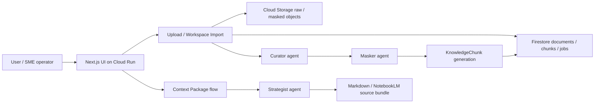

# AI-Ready Knowledge Hub

> SME の散らばった文書を、AI に安全に渡せる Context Package へ変換する。

[DevOps x AI Agent Hackathon 2026](https://findy.notion.site/devops-ai-agent-hackathon-2026) (Findy x Google Cloud) 提出作品です。

## 概要

SME では、AI に使わせたい社内情報が PDF、CSV、Google Sheets、メモ、テンプレート、古い資料、個人知に散らばっています。NotebookLM、Gemini、RAG などを使いたくても、どの情報を渡してよいか、顧客情報や個人情報を含む資料をそのまま渡してよいかを判断しにくいのが現場の課題です。

AI-Ready Knowledge Hub は、その前段を担当します。文書をアップロードすると AI エージェントが分類・抽出・マスキングし、目的を入力すると「使える情報」「除外すべき情報」「足りない情報」「人間に確認すべき質問」を整理した Context Package を生成します。

本作品は NotebookLM / Gemini / RAG を置き換えるものではありません。下流 AI に投入する情報を、実務で使える粒度とセキュリティ観点で準備するための前段プラットフォームです。

## デモで見せること

デモ題材は会計・社労士事務所です。士業の専門判断を代替するものではなく、機密文書と暗黙知を多く持つ SME の「AI 活用前の準備」を支援するユースケースとして扱います。

1. `/upload` から複数ファイルをまとめて投入する
2. Inventory で AI 利用可、マスキング済み、保護中の文書を確認する
3. `/context-package` で目的を入力する
4. 「候補を表示」で候補文書を選び、生成前の安全確認と生成前プレビューを確認する
5. Markdown または NotebookLM 用 source bundle zip として出力する

撮影用 purpose:

```text
新人スタッフ向けに、月次の給与計算業務を安全に学べるAIを作りたい
```

詳しい撮影順は [docs/demo-runbook.md](docs/demo-runbook.md) と [docs/demo-scenario.md](docs/demo-scenario.md) を参照してください。

## 主要機能

- **Multi-file upload**: PDF / CSV / XLSX / TXT / Markdown などをファイル単位で逐次処理
- **Google Workspace import**: Google Sheets / Google Docs を Drive API 経由で取り込み
- **Curator agent**: 文書種別、業務領域、鮮度、機密性、AI 利用可否を分類
- **Masker agent**: 個人情報や再識別リスクを検出し、AI 参照版または除外へ振り分け
- **Strategist agent**: 目的に対して必要な文書・不足情報・確認質問を整理
- **候補文書**: 目的から Inventory を metadata-only でスキャンし、生成前に人間が文書を選べる
- **Context Package export**: Markdown と NotebookLM 用 source bundle zip を生成
- **Document conversion**: official PDF / slide PDF / scan PDF を DocumentIR に変換し、評価可能な chunk へ変換
- **Quality gates**: extraction / masking / scan PDF drift を CI と eval で継続確認
- **Cloud Run delivery**: GitHub Actions から Cloud Run にデプロイ

## AI エージェント構成

| Agent | 役割 |
|---|---|
| Curator | 文書を分類し、業務領域・鮮度・AI 利用可否を判断する |
| Masker | 個人情報・顧客情報・再識別リスクを検出し、安全化または除外する |
| Strategist | 目的に対して必要な情報、除外理由、不足情報、確認質問をまとめる |

候補文書の選定は独立したエージェントではなく、`/context-package` の metadata-only フロー（「候補を表示」→ 生成前の安全確認 → 生成前プレビュー）で行います。

## Google Cloud / DevOps 要件への対応

| ハッカソン観点 | 本作品での対応 |
|---|---|
| つくる | Vertex AI / Gemini / Genkit を使い、Curator / Masker / Strategist が自律判断する |
| まわす | GitHub Actions、Vitest、typecheck、conversion eval、P1-D quality gate で継続検証する |
| とどける | Next.js app を Cloud Run にデプロイし、IAP / Firestore / GCS / Cloud Tasks と接続する |

## アーキテクチャ



詳細は [docs/architecture.md](docs/architecture.md) と [docs/tech-stack.md](docs/tech-stack.md) にあります。

## セキュリティと安全性

- 本番想定の標準 profile は `cloud-managed`
- Cloud Run / Firestore / GCS の管理境界内で文書を処理
- Cloud DLP または simple-rule provider で PII を検出
- `requires_masking` の文書は raw text を Context Package に fallback しない
- restricted / blocked / masking 未完了 chunk は Strategist に渡さない
- public blank form / synthetic fixture のみを sample と eval に使用
- 実顧客データ、credential、service account key、本番 export は repository に含めない

## 技術スタック

- Next.js / React / TypeScript
- pnpm
- Genkit
- Vertex AI Gemini
- Google Cloud Run
- Cloud Firestore
- Cloud Storage
- Cloud Tasks
- Cloud DLP
- GitHub Actions
- Vitest

## ローカル起動

Node.js 22 以上と pnpm が必要です。

```bash
pnpm install --frozen-lockfile
cp .env.local.example .env.local
pnpm dev
```

ブラウザで `http://localhost:3000/upload` を開きます。

実 GCP / Vertex / Firestore / GCS を使う場合は `.env.local` に少なくとも次を設定します。

```dotenv
GOOGLE_CLOUD_PROJECT=your-project-id
GOOGLE_CLOUD_LOCATION=global
KNOWLEDGE_HUB_BUCKET=your-bucket-name
KNOWLEDGE_HUB_DATA_RESIDENCY_LOCATION=asia-northeast1
GEMINI_MODEL=gemini-3.5-flash
SCAN_PDF_GEMINI_MODEL=gemini-3.1-flash-lite
```

詳しい GCP セットアップは [docs/setup-gcp.md](docs/setup-gcp.md) を参照してください。

## よく使うコマンド

| コマンド | 用途 |
|---|---|
| `pnpm dev` | 開発サーバー起動 |
| `pnpm build` | production build |
| `pnpm test` | unit test |
| `pnpm typecheck` | TypeScript typecheck |
| `pnpm eval:p1d:quality --ci` | extraction / masking stable quality gate |
| `pnpm eval:scan-pdf:ocr-live-drift --ci` | scan PDF OCR live drift check |
| `pnpm context:demo:live` | Firestore / GCS の実データから Context Package を生成 |
| `pnpm chunks:regenerate <docId>` | raw object から chunks を再生成 |
| `pnpm tsx scripts/oneoff/backfillSourceKind.ts --dry-run` | schemaVersion 1 document の backfill dry-run |

## 検証状況

PR #55 merge 時点で以下を確認済みです。

- GitHub Actions: Test / Typecheck / Build green
- Conversion eval required checks green
- `pnpm eval:p1d:quality --ci` pass
- scan-pdf refresh safety guard + deterministic adapter fallback を追加
- MHLW / NTA / synthetic invoice の stable report-only metrics は all 1.0
- production live smoke:
  - table-assist async ingest
  - multi-file upload queue

## 主要ディレクトリ

| パス | 内容 |
|---|---|
| `src/app/` | Next.js pages / API routes |
| `src/agents/` | Curator / Masker / Strategist flows |
| `src/lib/` | upload, extractors, storage, Firestore, masking, chunk generation |
| `src/services/` | Context Package orchestration と候補文書選定（`selectCandidates`） |
| `src/eval/` | conversion eval / quality gates |
| `sample-data/` | synthetic / public / masked fixtures |
| `docs/` | design docs, runbooks, evidence |
| `poc/document-conversion/` | document conversion PoC runners |

## 提出用ドキュメント

| ファイル | 内容 |
|---|---|
| [docs/concept.md](docs/concept.md) | コンセプトと提供価値 |
| [docs/scope.md](docs/scope.md) | MVP のスコープ |
| [docs/architecture.md](docs/architecture.md) | システム構成 |
| [docs/tech-stack.md](docs/tech-stack.md) | 技術選定 |
| [docs/demo-runbook.md](docs/demo-runbook.md) | デモ実行手順 |
| [docs/demo-scenario.md](docs/demo-scenario.md) | 3分動画のストーリーボード |
| [docs/operate-deliver-readiness.md](docs/operate-deliver-readiness.md) | 運用・提出 readiness |
| [docs/production-readiness.md](docs/production-readiness.md) | 本番 readiness |
| [docs/decisions.md](docs/decisions.md) | 採用判断ログ |
