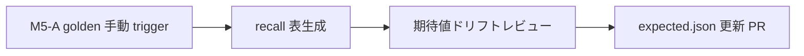

# Phase 3-H-2: Golden eval 月次レビュー手順

> 正本: [docs/phase-3-h-2-direction.md](phase-3-h-2-direction.md) §7.2（M4）・§8.2（M5）
> 対象: `official-doc-pdf`（subtype 1）の golden eval と `sample-data/document-conversion/official-doc-pdf/*.expected.json`

Golden eval は **重要情報の recall**（`semanticRetention.keyFieldRecall` / `missingExpectedFields`）を見る運用レビュー用ステージである。PR の必須 CI gate には載せず、**M5-A の手動 trigger** と月次レビューでのみ実行する。

| Stage | CI（通常 PR） | 月次レビュー |
|---|---|---|
| health | 必須 gate（block） | — |
| heuristic | warning（block しない） | — |
| golden | **呼ばない** | 本手順（レビュー対象、block しない） |

---

## 1. いつやるか

- **頻度**: 月 1 回（推奨: 月初の営業日）。converter / chunker / `documentIrToKnowledgeChunks` に golden 対象の変更が入った月は、マージ後に臨時で 1 回追加してよい。
- **担当**: Document Conversion eval を触った実装者、またはその PR のレビュア。
- **完了条件**: recall 表を残し、ドリフトを分類し、必要なら `*.expected.json` 更新 PR をマージ（または「期待値変更なし」を記録）したこと。

---

## 2. 前提

1. リポジトリルートで依存を入れている。

   ```bash
   pnpm install --frozen-lockfile
   ```

2. Golden fixture は次 4 件（いずれも `sample-data/document-conversion/official-doc-pdf/`）。

   | `documentId` | PDF | sidecar |
   |---|---|---|
   | `mhlw-r07-model-work-rules` | `mhlw-r07-model-work-rules.pdf` | `*.document-ir.json`, `*.expected.json` |
   | `mhlw-labor-conditions-notice-general` | `mhlw-labor-conditions-notice-general.pdf` | 同上 |
   | `mhlw-overtime-limit-guide` | `mhlw-overtime-limit-guide.pdf` | 同上 |
   | `synthetic-employment-context-with-pii` | `synthetic-employment-context-with-pii.pdf` | 同上（**非 PII の残存情報のみ**を expected に書く） |

3. 評価実装の入口:
   - `runConversionEvalGoldenCheck` — [`src/eval/conversion/runConversionEvalGoldenCheck.ts`](../src/eval/conversion/runConversionEvalGoldenCheck.ts)
   - `evalSemanticRetention` — [`src/eval/conversion/golden/evalSemanticRetention.ts`](../src/eval/conversion/golden/evalSemanticRetention.ts)
   - Fixture 結合テスト — [`src/eval/conversion/golden/__tests__/evalSemanticRetention.fixtures.test.ts`](../src/eval/conversion/golden/__tests__/evalSemanticRetention.fixtures.test.ts)

4. `*.expected.json` の形（例）:

   ```json
   {
     "documentId": "mhlw-r07-model-work-rules",
     "expectedFields": ["モデル就業規則", "令和７年 12 月版", "…"],
     "notes": "任意: 出典・版・レビュー観点"
   }
   ```

   期待フィールドの粒度は方向性メモ §7.2 に従う（様式名 / 適用年 / 章タイトル / 表の主要セル / 記入欄ラベル / 重要金額・日付）。マッチは chunk 連結テキストへの **正規化 substring match**（NFKC + 空白折りたたみ）。

---

## 3. 手順（4 ステップ）



### Step 1 — Golden 手動 trigger（M5-A）

**目的**: 本番相当の golden stage を 1 回走らせ、artifact またはログをレビュー用に残す。

**GitHub Actions（M5-A 正本）**

M5 完了後は [`.github/workflows/conversion-eval.yml`](../.github/workflows/conversion-eval.yml) の **`workflow_dispatch`** で golden のみ実行する（通常の `pull_request` / `push` ジョブからは **golden を呼ばない**）。

1. GitHub → **Actions** → **Conversion eval**（ワークフロー名は M5 実装に合わせる）。
2. **Run workflow** を選び、入力で `stage=golden`（または同等の M5-A ラベル）を指定。
3. 実行完了まで待つ。失敗しても **main / PR は block されない**（§8.2）。失敗内容は Step 3 のドリフト分類に使う。
4. ワークフローが吐く **recall サマリ artifact**（または job summary）をダウンロードし、Step 2 の表の元にする。

> **M5-A 未導入時のローカル代替**（月次レビューを止めないための暫定）:
>
> ```bash
> pnpm vitest run \
>   src/eval/conversion/golden/__tests__/evalSemanticRetention.fixtures.test.ts \
>   --reporter=verbose
> ```
>
> M5-A が入ったら、以降の月次は **Actions 手動 trigger を正** とし、ローカルは差分確認用にとどめる。

**DocumentIR の更新が入った月**

PDF から IR を再生成して sidecar を揃えてから golden を走らせる（PoC runner または本線 export 手順。詳細は [sample-data/document-conversion/README.md](../sample-data/document-conversion/README.md) と PoC README を参照）。

```bash
# 例: 単一 PDF の PoC 変換（IR 更新のたびに手順を再確認すること）
pnpm poc:conversion:official-doc-pdf \
  sample-data/document-conversion/official-doc-pdf/mhlw-r07-model-work-rules.pdf
```

---

### Step 2 — Recall 表の生成

**目的**: fixture ごとの `keyFieldRecall` と欠落フィールドを 1 枚にまとめ、前月・前回実行と比較できるようにする。

次の列を持つ表を **Issue / PR コメント / 社内メモ** のいずれかに残す（テンプレート）。

| documentId | expectedCount | keyFieldRecall | missingCount | missingExpectedFields（先頭 5 件まで） | 前月比 | メモ |
|---|---:|---:|---:|---|---|---|
| `mhlw-r07-model-work-rules` | | | | | ↑ / ↓ / → | |
| `mhlw-labor-conditions-notice-general` | | | | | | |
| `mhlw-overtime-limit-guide` | | | | | | |
| `synthetic-employment-context-with-pii` | | | | | | 非 PII のみ |

- `keyFieldRecall` = `found / len(expectedFields)`（実装: [`evalSemanticRetention`](../src/eval/conversion/golden/evalSemanticRetention.ts)）。
- M5-A artifact に表が含まれる場合はそれをコピーし、無い場合は Step 1 のログから手で埋める。
- **前月比** は直近の月次記録または前回 workflow の artifact と突き合わせる。

---

### Step 3 — 期待値ドリフトのレビュー

各 fixture の差分を次のどちらかに分類する。

| 分類 | 意味 | 典型原因 | 対応 |
|---|---|---|---|
| **A. 回帰（バグ）** | 意図しない recall 低下 | extractor / chunk 分割 / 正規化の退行 | コード修正 PR。**expected.json を緩めない** |
| **B. 意図的な変換改善** | より正しい chunk 化・表現だが substring が変わった | pdf-parse 調整、見出し分割、表セルテキストの変化 | `expected.json` を更新（Step 4） |
| **C. 期待値の陳腐化** | 版・様式・公開 PDF の差し替え | 厚労省 PDF の改版、fixture PDF の差し替え | sidecar（`document-ir.json` + `expected.json`）をセットで更新 |
| **D. 許容（レビューのみ）** | recall は下がったが downstream 上問題ないと判断 | 補助的な expected フィールドの削除に相当する欠落 | `notes` に理由を書き、expected から削除する PR でも可 |

**レビュー時のチェックリスト**

- [ ] `missingExpectedFields` の各文字列が、元 PDF / `document-ir.json` 上に本当に存在するか（誤った expected の削除候補になっていないか）。
- [ ] PII fixture（`synthetic-employment-context-with-pii`）の expected に **実 PII や顧客固有文字列を足していないか**（§7.3）。PII 検出の評価は `safetyReadiness` 側の責務。
- [ ] recall 低下が **1 fixture に集中**していないか（単一 PDF の版違い vs 共通 regress の切り分け）。
- [ ] golden は **CI gate にしない** 方針のまま、heuristic / health の CI 結果と矛盾しないか（golden だけ直して本線 gate を壊していないか）。

---

### Step 4 — `expected.json` 更新 PR

**A / 回帰** の場合は Step 4 ではなくコード修正 PR を先に出す。

**B / C / D** で expected の変更が必要なとき:

1. ブランチを切る（例: `chore/golden-expected-2026-05`）。
2. 変更対象の `sample-data/document-conversion/official-doc-pdf/<basename>.expected.json` を編集する。
   - `documentId` は basename と一致させる。
   - 追加する文字列は **chunk 連結テキストに substring として載る** 表現を選ぶ（全角 / 半角は正規化で吸収されるが、改行で分割された語は chunk 境界を跨ぐ必要がある場合あり — テスト [`evalSemanticRetention.test.ts`](../src/eval/conversion/golden/__tests__/evalSemanticRetention.test.ts) 参照）。
   - `notes` に改版・意図・レビュー日を書く。
3. DocumentIR sidecar も変えた場合は `*.document-ir.json` を同じ PR に含める。
4. 検証:

   ```bash
   pnpm vitest run \
     src/eval/conversion/golden/__tests__/evalSemanticRetention.fixtures.test.ts
   pnpm typecheck
   ```

5. PR 説明に **Step 2 の recall 表**（更新後）と **分類（B/C/D）** を貼る。タイトル例: `chore(eval): refresh golden expected fields for mhlw-r07 (2026-05 review)`。
6. レビュアは表と `missingExpectedFields` の差分を見てマージ。golden は **required check にしない**。

---

## 4. CI との境界（再掲）

| やること | やらないこと |
|---|---|
| M5-A `workflow_dispatch` で月次 golden | `pull_request` / `push` の default ジョブから golden を実行 |
| recall 表と expected 更新 PR で人間レビュー | golden 失敗で main を block |
| health を通常 CI で必須のまま維持 | golden の結果を deploy workflow の必須依存にする |

通常 PR で走るのは **health（必須）** と **heuristic（warning）** のみ。詳細は [docs/phase-3-h-2-direction.md §8](phase-3-h-2-direction.md#8-m5-ci-gate-接続) を参照。

---

## 5. 関連ドキュメント

- [docs/phase-3-h-2-direction.md](phase-3-h-2-direction.md) — M4 golden / M5 CI gate
- [docs/phase-3-e-direction.md](phase-3-e-direction.md) — 三段階成熟度と golden の意味
- [docs/phase-3-h-direction.md](phase-3-h-direction.md) — subtype 別 eval 方針
- [sample-data/document-conversion/README.md](../sample-data/document-conversion/README.md) — fixture 出典・ライセンス
