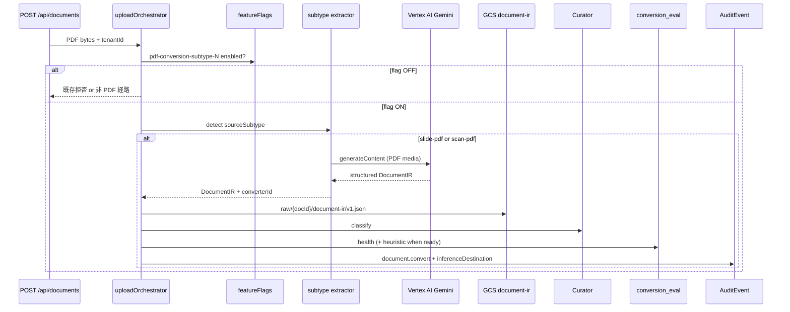

# Phase 3-H-3 方向性メモ: slide-pdf / scan-pdf の本線統合足場

> 作成: 2026-05-20
> 背景: Phase 3-H-2 M6（[docs/phase-3-h-2-direction.md](phase-3-h-2-direction.md) §9）の引き継ぎ。subtype 1（`official-doc-pdf`）の薄い本線統合・Eval 育成ループ（health / heuristic / golden / CI）が揃ったあと、**Vertex AI 推論を伴う subtype 2 / 3** を同じ upload 境界へ段階的に載せるための足場を docs で固定する。本フェーズは実装スコープの確定ではなく、着手判断（`D-P3-H-6`）と未決の棚卸しを正本化する。

## 変更履歴

- **2026-05-20 (v1)**: 初版。Phase 3-H-2 §9 骨子に沿い、ゴール / Vertex 統合方針 / feature flag / `inferenceDestination` / Masker タイミングを記載。
- **2026-05-20 (v2)**: §4.2 に `AuditInferenceDestination` の `document.convert` 必須化条件を仕様として確定（M2-C 型予約の実装引き継ぎ）。

---

## 1. ゴール: subtype 2 / 3 の本線統合

Phase 3-H-3 では、PoC で確立した次の 2 subtype を **subtype 1 と同型の薄い本線統合** として upload 経路に載せる。

| subtype | `sourceSubtype` | 変換の性質 | Phase 3-H Priority |
|---|---|---|---|
| 2 | `slide-pdf` | Gemini 直読み first-choice、`pdf-parse` fallback | 優先 2 |
| 3 | `scan-pdf` | Gemini OCR（Vertex AI）、Document AI は PoC 未試走 | 優先 3 |

**Phase 3-H-3 の一行定義:**

> `slide-pdf` / `scan-pdf` を、Firestore feature flag（`pdf-conversion-subtype-2` / `pdf-conversion-subtype-3`）で gating した薄い本線統合として PDF → Curator まで通し、Vertex AI 呼出時は AuditEvent に `inferenceDestination` を記録し、DocumentIR / ConversionEvalResult の観測ループを subtype 1 と同じ形で継続する。

**M1 境界（subtype 1 踏襲）:**

> 「PDF を本線に入れる」ではなく、**「PDF を Curator 判定まで本線に入れ、`aiUsePolicy === 'direct'` の PDF だけ chunk 化する」**。`requires_masking` / `blocked` は [docs/phase-3-h-2-direction.md](phase-3-h-2-direction.md) §4.5 / [docs/decisions.md](decisions.md) `D-P3-H-4 Q5` と同じ。

**着手前提（Phase 3-H-2 完了物）:**

- `feature_flags` collection と `pdf-conversion-subtype-1` の運用実績
- `uploadOrchestrator` の PDF 分岐、`documentIrStorage`（GCS `raw/{docId}/document-ir/v1.json`）、`conversion_eval` 観測
- AuditEvent `document.convert`（`converterId` / `sourceSubtype` / `evalStatus`）。`inferenceDestination` は M2 で型予約のみ（未設定）。**必須化条件は本 doc §4.2 で確定**（subtype 2/3 の Gemini 呼出時のみ）
- subtype 1 の health / heuristic / golden / CI gate の型と runner

**やらないこと（本フェーズ docs のスコープ外）:**

| 範囲外 | 移送先 |
|---|---|
| `office-native`（subtype 4） | 後続 |
| Document AI を scan-pdf の first-choice にする | PoC 方針どおり未試走。必要なら別判断 |
| Masker 本線統合（PDF 経路）の最終タイミング | §5（未決） |
| feature flag 全 tenant 公開 | M5 相当の判断を subtype 2/3 でも再実施 |
| BigQuery write-once audit | Phase 4 |

---

## 2. Vertex AI Gemini 呼出の upload pipeline 統合方針

### 2.1 原則

- **推論境界は `uploadOrchestrator` に集約**する。PoC runner（`pnpm poc:conversion:slide-pdf` / `scan-pdf`）の CLI 経路と本線を分離したまま、本線用 extractor を `src/lib/extractors/` に昇格させる。
- **設定は既存 Genkit / Vertex 経路を流用**する（`GOOGLE_CLOUD_PROJECT`、`GOOGLE_CLOUD_LOCATION`、`GEMINI_MODEL`）。新しい推論 SDK 境界は増やさない。
- **subtype 1 との差分は「Vertex 呼出の有無」と監査メタデータ**に閉じる。status 遷移、`maskingPending`、DocumentIR GCS 保存、ConversionEval append-only は共通。

### 2.2 subtype 別 extractor 方針

| subtype | 本線 first-choice（案） | fallback | PoC 参照 |
|---|---|---|---|
| `slide-pdf` | `slidePdfGeminiExtractor`（PDF を `application/pdf` media で Gemini 直読み） | `pdf-parse`（`converterId: pdf-parse-fallback`） | [poc/document-conversion/slide-pdf/runner.ts](../poc/document-conversion/slide-pdf/runner.ts)、[docs/phase-3-h-slide-pdf-poc.md](phase-3-h-slide-pdf-poc.md) |
| `scan-pdf` | `scanPdfGeminiOcrExtractor`（Gemini OCR JSON → DocumentIR） | なし（OCR 失敗は fail-closed 候補） | [poc/document-conversion/scan-pdf/runner.ts](../poc/document-conversion/scan-pdf/runner.ts) |

### 2.3 upload pipeline 上の挿入点



### 2.4 コスト・障害・fail-open / fail-closed（ドラフト）

| 論点 | slide-pdf（案） | scan-pdf（案） | 確定先 |
|---|---|---|---|
| 1 request サイズ上限 | PoC 同様 30 MB 未満を初期案 | 同左 | `D-P3-H-6` / open-questions |
| quota / timeout | Gemini 失敗時 **PoC は fallback**、本線は tenant 方針で fail-closed 選択肢を残す | OCR 失敗時 **fail-closed**（chunk 化しない） | 未決 |
| cost visibility | `conversion` metadata + 将来 `ocrUsage` / token を eval に載せる | PoC の `ocrCost` フィールドを eval へ昇格検討 | M2 観測後 |
| 本線での `SLIDE_PDF_SKIP_GEMINI` | **採用しない**（本線は明示 flag のみ） | — | 実装時 |

**未決:** slide-pdf を本線で「Gemini 失敗 → pdf-parse fallback」とするか、subtype 1 同様に health fail で止めるかは [docs/open-questions.md](open-questions.md) に記載。

---

## 3. Feature flag: `pdf-conversion-subtype-2` / `pdf-conversion-subtype-3`

### 3.1 命名規約（subtype 1 踏襲）

| flagId | 対象 `sourceSubtype` | 備考 |
|---|---|---|
| `pdf-conversion-subtype-1` | `official-doc-pdf` | Phase 3-H-2 M1 で確定（[docs/decisions.md](decisions.md) `D-P3-H-4 Q1`） |
| `pdf-conversion-subtype-2` | `slide-pdf` | 本フェーズで新設 |
| `pdf-conversion-subtype-3` | `scan-pdf` | 本フェーズで新設 |

- schema は `D-P3-H-4 Q1` の `FeatureFlag` 型をそのまま使う（`defaultEnabled` / `enabledTenants` / `expiresAt?` / `description`）。
- **flag は subtype 単位で独立**。subtype 2 を ON にしても subtype 3 は自動 ON にしない。
- 初期運用: dev tenant allow-list + `expiresAt` 必須（PoC flag 運用ルール踏襲）。

### 3.2 `/api/documents` との関係

- MIME `application/pdf` 受理は、**いずれかの subtype flag が ON** かつ extractor が subtype を判定した場合に限る（判定ロジックは実装時に `D-P3-H-6` で確定）。
- subtype 1 と同様、flag OFF tenant では PDF upload を拒否する（fail-closed）。

### 3.3 公開範囲拡大

- subtype 1 で M5 完了時に確定する「公開範囲拡大条件」（[docs/phase-3-h-2-direction.md](phase-3-h-2-direction.md) §3）は、subtype 2/3 でも **heuristic / golden / コスト実測後** に別エントリで再判断する。Phase 3-H-3 着手時点では dev tenant 限定を前提とする。

---

## 4. AuditEvent `inferenceDestination` 拡張

### 4.1 Phase 3-E `ProcessingRecord` との接続

[docs/phase-3-e-direction.md](phase-3-e-direction.md) §6.1 で定義した `ProcessingRecord` の `inferenceDestination` は、Vertex 推論の **vendor / region / model** を監査に残すための最小形である。

```ts
// phase-3-e-direction.md §6.1（抜粋）
inferenceDestination: {
  vendor: 'vertex';
  region: string;
  model: string;
};
```

本リポジトリでは、同等 shape を `AuditInferenceDestination` として [src/lib/audit/auditEvent.ts](../src/lib/audit/auditEvent.ts) に既に定義済み。`document.export`（Strategist / Context Package 生成）では **設定済み**（[src/app/api/context-package/route.ts](../src/app/api/context-package/route.ts)）。`document.convert` では Phase 3-H-2 M2 時点で **未設定のまま予約**。

### 4.2 `document.convert` への `inferenceDestination` 必須化（仕様確定）

Phase 3-H-2 M2-C で [src/lib/audit/auditEvent.ts](../src/lib/audit/auditEvent.ts) に予約した `inferenceDestination` について、Phase 3-H-3 実装時に次を **正本仕様** とする。

#### 型（`AuditInferenceDestination`）

```ts
type AuditInferenceDestination = {
  vendor: 'vertex';
  region: string;
  model: string;
};
```

- 意味・フィールド名は [docs/phase-3-e-direction.md](phase-3-e-direction.md) §6.1 `ProcessingRecord.inferenceDestination` と一致させる（部分集合）。
- `vendor` は常にリテラル `'vertex'`。`region` / `model` は **実際に呼び出した Vertex Gemini のロケーションとモデル ID** を記録する。

#### `document.convert` で必須とする条件

`action: 'document.convert'` の AuditEvent に `inferenceDestination` を **必須**（省略不可）とするのは、次を **すべて**満たすときのみとする。

| # | 条件 |
|---|---|
| 1 | `conversion.sourceSubtype` が **`slide-pdf`（subtype 2）または `scan-pdf`（subtype 3）** |
| 2 | 当該 upload の変換パスで **Vertex AI 上の Gemini を実際に呼び出した**（first-choice 成功。例: `converterId` が `gemini-direct-read` / `gemini-vertex-ocr` 等） |
| 3 | `recordAuditEvent` を呼ぶ成功パス（`result` が `success` または eval に応じた `partial`。変換処理自体が完了している） |

**要約（一行）:** `AuditInferenceDestination` は **`document.convert` に対し、subtype 2/3 で Gemini（Vertex）呼出が発生したときだけ必須** とする。

#### 必須にしない（省略してよい）条件

| ケース | `inferenceDestination` |
|---|---|
| `conversion.sourceSubtype === 'official-doc-pdf'`（subtype 1 / `pdf-parse` のみ） | **付けない**（M2 どおり `conversion` のみ） |
| subtype 2/3 でも **Gemini を呼ばず** `pdf-parse-fallback` のみで完結した変換 | **付けない** |
| Vertex 呼出を試みたが **変換成功前に失敗**し `document.convert` を書かないパス | 該当イベントなし（別途失敗監査は Phase 3-G 以降） |
| `document.export` / `document.import` 等、他 action | 本節の対象外（export は既存実装どおり） |

subtype 1 本線（Phase 3-H-2）では Gemini 呼出がないため、M2 で確立した「`conversion` のみ・`inferenceDestination` 未設定」は **変更しない**。

#### 記録値（実装時の初期案）

必須化条件を満たす `document.convert` では、少なくとも次を埋める。

```ts
inferenceDestination: {
  vendor: 'vertex',
  region: process.env.GOOGLE_CLOUD_LOCATION ?? 'asia-northeast1',
  model: process.env.GEMINI_MODEL ?? 'gemini-2.5-flash',
}
```

`processingProfile` / `dataResidency` / `purposeBinding` との関係:

- `document.convert` では、Phase 3-E の `ProcessingRecord` 全体は **必須にしない**（Phase 3-E は export 中心の最小メタデータ）。まず `inferenceDestination` と `conversion.{converterId,sourceSubtype,evalStatus}` を揃える。
- 将来 Phase 4 で BigQuery write-once audit に送るとき、§6.1 の `ProcessingRecord` へ **フィールド単位で昇格**できるよう、型と意味を一致させる（二重定義は避け、`AuditInferenceDestination` = §6.1 部分集合）。

### 4.3 `conversion` メタデータとの併記

既存 `AuditEventConversion`:

```ts
conversion?: {
  converterId: string;       // 例: gemini-direct-read | gemini-ocr | pdf-parse-fallback
  sourceSubtype: 'slide-pdf' | 'scan-pdf' | 'official-doc-pdf';
  evalStatus: 'pass' | 'warn' | 'fail' | 'error';
};
```

Phase 3-H-3 では、§4.2 の必須化条件を満たす `document.convert` に `inferenceDestination` を **同じ AuditEvent 行**へ必須で併記する。テスト方針: [src/lib/audit/__tests__/auditEvent.test.ts](../src/lib/audit/__tests__/auditEvent.test.ts) の「未設定」ケースは subtype 1 / fallback のまま残し、subtype 2/3 + Gemini 成功用ケースを追加する。

---

## 5. Masker 本線統合タイミング（未決）

subtype 1 と同様、KnowledgeChunk invariant rule 3（`requires_masking` chunk は `maskedText` 非空必須）により、**Masker 本線統合前は `requires_masking` PDF を chunk 化しない**（`maskingPending: true` で停止）。

| 選択肢 | 内容 | 影響 |
|---|---|---|
| (a) Phase 3-H-3 内で Masker を PDF 経路に接続 | subtype 2/3 統合と同じフェーズで `safety_readiness` 本格評価・PII fixture 本線観測が可能 | スコープ肥大、Vertex + DLP + Masker の障害切り分けが難しい |
| (b) Phase 3-H-3 後の別フェーズ | subtype 2/3 は `direct` 中心の公的・自己所有資料で観測を始め、Masker は後送り | [docs/phase-3-h-2-direction.md](phase-3-h-2-direction.md) §10 と整合。PII 入り PDF は PoC 経路継続 |

**現時点のドラフト:** `D-P3-H-6` では **(b) を推奨案**として記載し、product 判断で (a) に振り替え可能とする。確定は [docs/open-questions.md](open-questions.md) 参照。

---

## 6. 実装マイルストーン（案・未確定）

Phase 3-H-2 と同型の番号を仮置きする。順序は `D-P3-H-6` 確定後に更新する。

| Milestone | 内容 |
|---|---|
| M1 | `pdf-conversion-subtype-2` + slide extractor 本線昇格 + `inferenceDestination` on Vertex 成功 |
| M2 | subtype 2 観測（`conversion_eval`、export script 流用） |
| M3 | heuristic 閾値（slide 用。PoC 暫定表を起点） |
| M4 | golden fixture（`sample-data/document-conversion/slide-pdf/*.expected.json`） |
| M5 | CI: subtype 2 を health 必須（既存 workflow 拡張） |
| M6 | subtype 3 について M1〜M5 を繰り返し（flag `pdf-conversion-subtype-3`） |

---

## 7. DoD（docs フェーズ）

Phase 3-H-2 M6 の docs 完了条件:

- [docs/phase-3-h-3-direction.md](phase-3-h-3-direction.md) が本ファイルとして存在する
- [docs/decisions.md](decisions.md) に `D-P3-H-6` ドラフトがある
- 未決が [docs/open-questions.md](open-questions.md) に追記されている
- 関連リンク（phase-3-e §6.1、phase-3-h-2 §9、auditEvent.ts）が切れていない

実装 DoD は `D-P3-H-6` 確定後に本ファイルへ §8 として追加する。

---

## 関連ドキュメント

- [docs/phase-3-h-2-direction.md](phase-3-h-2-direction.md) — Phase 3-H-2 正本（§9 引き継ぎ元）
- [docs/phase-3-h-direction.md](phase-3-h-direction.md) — subtype 優先順位・変換器表
- [docs/phase-3-e-direction.md](phase-3-e-direction.md) — `ProcessingRecord` / Eval 契約
- [docs/phase-3-h-slide-pdf-poc.md](phase-3-h-slide-pdf-poc.md) — slide-pdf PoC コスト・fallback
- [docs/decisions.md](decisions.md) — `D-P3-H-4` / `D-P3-H-5` / `D-P3-H-6`
- [docs/open-questions.md](open-questions.md) — Phase 3-H-3 未決
- [poc/document-conversion/README.md](../poc/document-conversion/README.md) — PoC runner 一覧
