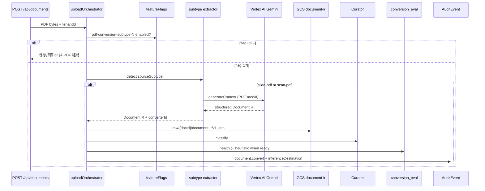

# Phase 3-H-3 方向性メモ: slide-pdf / scan-pdf の本線統合足場

> 作成: 2026-05-20
> 背景: Phase 3-H-2 M6（[docs/phase-3-h-2-direction.md](phase-3-h-2-direction.md) §9）の引き継ぎ。subtype 1（`official-doc-pdf`）の薄い本線統合・Eval 育成ループ（health / heuristic / golden / CI）が揃ったあと、**Vertex AI 推論を伴う subtype 2 / 3** を同じ upload 境界へ段階的に載せるための足場を docs で固定する。本フェーズは実装スコープの確定ではなく、着手判断（`D-P3-H-6`）と未決の棚卸しを正本化する。

## 変更履歴

- **2026-05-21 (v4)**: §8.3 M6 着手ゲート #4 完了、完了判定基準 v2（pre-flight 400 / 413 degraded / deterministic unmaskable fixture）、M6-1〜M6-7 に `D-P3-H-7` 2026-05-21 追補反映。§9 末尾に OCR fail-closed 証跡方針を追記。
- **2026-05-20 (v3)**: Phase 3-H-2 完了を前提に着手ゲートを更新（CI gate + 観測ループ確立済み）。
- **2026-05-20 (v1)**: 初版。Phase 3-H-2 §9 骨子に沿い、ゴール / Vertex 統合方針 / feature flag / `inferenceDestination` / Masker タイミングを記載。
- **2026-05-20 (v2)**: §4.2 に `AuditInferenceDestination` の `document.convert` 必須化条件を仕様として確定（M2-C 型予約の実装引き継ぎ）。

---

## 1. ゴール: subtype 2 / 3 の本線統合

Phase 3-H-3 では、PoC で確立した次の 2 subtype を **subtype 1 と同型の薄い本線統合** として upload 経路に載せる。

| subtype | `sourceSubtype` | 変換の性質 | Phase 3-H Priority |
|---|---|---|---|
| 2 | `slide-pdf` | Gemini 直読み、fallback なし / fail-closed | 優先 2 |
| 3 | `scan-pdf` | Gemini OCR（Vertex AI）、Document AI は PoC 未試走 | 優先 3 |

**Phase 3-H-3 の一行定義:**

> `slide-pdf` / `scan-pdf` を、Firestore feature flag（`pdf-conversion-subtype-2` / `pdf-conversion-subtype-3`）で gating した薄い本線統合として PDF → Curator まで通し、Vertex AI 呼出時は AuditEvent に `inferenceDestination` を記録し、DocumentIR / ConversionEvalResult の観測ループを subtype 1 と同じ形で継続する。

**M1 境界（subtype 1 踏襲）:**

> 「PDF を本線に入れる」ではなく、**「PDF を Curator 判定まで本線に入れ、`aiUsePolicy === 'direct'` の PDF だけ chunk 化する」**。`requires_masking` / `blocked` は [docs/phase-3-h-2-direction.md](phase-3-h-2-direction.md) §4.5 / [docs/decisions.md](decisions.md) `D-P3-H-4 Q5` と同じ。

**着手前提（Phase 3-H-2 完了 — 2026-05-20）:**

[docs/phase-3-h-2-direction.md](phase-3-h-2-direction.md) §13 Completion Snapshot を満たしていること。特に次が **H-3 実装開始の必須条件**:

1. **H-2 CI gate + observation loop established** — `conversion_eval` append、`document.convert` AuditEvent、`.github/workflows/conversion-eval.yml` の health 必須 gate、ruleset `main required checks`（`D-P3-H-5b`）。
2. **subtype 1 本線の実機確認** — IAP 上で `direct` PDF は chunk 化、`requires_masking` PDF は `maskingPending: true` で停止（Masker 未統合のまま）。
3. **Eval 三段の運用分離** — health = merge blocker、heuristic = PR warning、golden = 手動/月次（expected チューニングは H-2 後続運用）。

**引き継ぎ済みの基盤:**

- `feature_flags` + `pdf-conversion-subtype-1`（`m-grow-ai.com`、`expiresAt` 2026-06-30）
- `uploadOrchestrator` PDF 分岐、`documentIrStorage`、`conversionEvalStorage`
- AuditEvent `document.convert`（`inferenceDestination` は型予約のみ。**必須化は本 doc §4.2** — subtype 2/3 + Vertex 成功時）
- subtype 1 の heuristic 閾値（`D-P3-H-5`）と golden runner（recall ベースライン §7.4）

**やらないこと（本フェーズ docs のスコープ外）:**

| 範囲外 | 移送先 |
|---|---|
| `office-native`（subtype 4） | 後続 |
| Document AI を scan-pdf の first-choice にする | PoC 方針どおり未試走。必要なら別判断 |
| Masker 本線統合（PDF 経路）の最終タイミング | §5（未決） |
| feature flag 全 tenant 公開 | M5 相当の判断を subtype 2/3 でも再実施 |
| BigQuery write-once audit | Phase 4 |

---

## 2. Vertex AI Gemini 呼出の upload pipeline 統合方針

### 2.1 原則

- **推論境界は `uploadOrchestrator` に集約**する。PoC runner（`pnpm poc:conversion:slide-pdf` / `scan-pdf`）の CLI 経路と本線を分離したまま、本線用 extractor を `src/lib/extractors/` に昇格させる。
- **設定は既存 Genkit / Vertex 経路を流用**する（`GOOGLE_CLOUD_PROJECT`、`GOOGLE_CLOUD_LOCATION`、`GEMINI_MODEL`）。新しい推論 SDK 境界は増やさない。
- **subtype 1 との差分は「Vertex 呼出の有無」と監査メタデータ**に閉じる。status 遷移、`maskingPending`、DocumentIR GCS 保存、ConversionEval append-only は共通。

### 2.2 subtype 別 extractor 方針

| subtype | 本線 first-choice（案） | fallback | PoC 参照 |
|---|---|---|---|
| `slide-pdf` | `slidePdfGeminiExtractor`（PDF を `application/pdf` media で Gemini 直読み） | なし（PoC runner の `pdf-parse` fallback は本線へ持ち込まない） | [poc/document-conversion/slide-pdf/runner.ts](../poc/document-conversion/slide-pdf/runner.ts)、[docs/phase-3-h-slide-pdf-poc.md](phase-3-h-slide-pdf-poc.md) |
| `scan-pdf` | `scanPdfGeminiOcrExtractor`（Gemini OCR JSON → DocumentIR） | なし（OCR 失敗は fail-closed 候補） | [poc/document-conversion/scan-pdf/runner.ts](../poc/document-conversion/scan-pdf/runner.ts) |

### 2.3 upload pipeline 上の挿入点



### 2.4 コスト・障害・fail-open / fail-closed（ドラフト）

| 論点 | slide-pdf（案） | scan-pdf（案） | 確定先 |
|---|---|---|---|
| 1 request サイズ上限 | **本線（M1）:** `MAX_UPLOAD_BYTES` = **5 MiB**（`src/lib/documents.ts`、全 upload 共通）。PoC runner は 30 MB 未満を別上限として温存 | 同左（本線 5 MiB） | **M1 確定（本線）** / PoC は従来表のまま |
| quota / timeout | Gemini 失敗時 **本線は fail-closed**（pdf-parse fallback を持たない、`D-P3-H-6 Q2` 確定 2026-05-20）。PoC runner の fallback / `SLIDE_PDF_SKIP_GEMINI` は PoC 専用 | OCR 失敗時 **fail-closed**（chunk 化しない） | `D-P3-H-6 Q2` 確定 |
| cost visibility | `conversion` metadata + 将来 `ocrUsage` / token を eval に載せる | PoC の `ocrCost` フィールドを eval へ昇格検討 | M2 観測後 |
| 本線での `SLIDE_PDF_SKIP_GEMINI` | **採用しない**（本線は明示 flag のみ） | — | 実装時 |

**確定（2026-05-20、`D-P3-H-6 Q2`）:** slide-pdf 本線は **pdf-parse fallback を持たず fail-closed**。subtype 2 を subtype 1 と分離した理由（pdf-parse では拾えないため Gemini を first-choice にする）と整合させる。PoC runner の fallback / `SLIDE_PDF_SKIP_GEMINI` は PoC 専用として温存。

---

## 3. Feature flag: `pdf-conversion-subtype-2` / `pdf-conversion-subtype-3`

### 3.1 命名規約（subtype 1 踏襲）

| flagId | 対象 `sourceSubtype` | 備考 |
|---|---|---|
| `pdf-conversion-subtype-1` | `official-doc-pdf` | Phase 3-H-2 M1 で確定（[docs/decisions.md](decisions.md) `D-P3-H-4 Q1`） |
| `pdf-conversion-subtype-2` | `slide-pdf` | 本フェーズで新設 |
| `pdf-conversion-subtype-3` | `scan-pdf` | 本フェーズで新設 |

- schema は `D-P3-H-4 Q1` の `FeatureFlag` 型をそのまま使う（`defaultEnabled` / `enabledTenants` / `expiresAt?` / `description`）。
- **flag は subtype 単位で独立**。subtype 2 を ON にしても subtype 3 は自動 ON にしない。
- 初期運用: dev tenant allow-list + `expiresAt` 必須（PoC flag 運用ルール踏襲）。

### 3.2 `/api/documents` との関係（M1 実装）

- MIME `application/pdf` 受理は、tenant に対して **有効な PDF conversion flag がちょうど 1 つ** の場合に限る（fail-closed）。
- **同一 tenant で `pdf-conversion-subtype-1` と `pdf-conversion-subtype-2` を同時 ON にしない。** 両方 ON のとき API は **403** で拒否する（配列順による暗黙の優先は使わない）。
- M1 では **PDF 内容から subtype を自動判定しない。** flag が選んだ extractor（official-doc = `pdf-parse`、slide = Gemini direct-read）が `sourceSubtype` を決める。将来の自動判定は別 decision。
- flag が 0 個の tenant では PDF upload を拒否する（403、subtype 1 と同型）。

### 3.3 公開範囲拡大

- subtype 1 で M5 完了時に確定する「公開範囲拡大条件」（[docs/phase-3-h-2-direction.md](phase-3-h-2-direction.md) §3）は、subtype 2/3 でも **heuristic / golden / コスト実測後** に別エントリで再判断する。Phase 3-H-3 着手時点では dev tenant 限定を前提とする。

---

## 4. AuditEvent `inferenceDestination` 拡張

### 4.1 Phase 3-E `ProcessingRecord` との接続

[docs/phase-3-e-direction.md](phase-3-e-direction.md) §6.1 で定義した `ProcessingRecord` の `inferenceDestination` は、Vertex 推論の **vendor / region / model** を監査に残すための最小形である。

```ts
// phase-3-e-direction.md §6.1（抜粋）
inferenceDestination: {
  vendor: 'vertex';
  region: string;
  model: string;
};
```

本リポジトリでは、同等 shape を `AuditInferenceDestination` として [src/lib/audit/auditEvent.ts](../src/lib/audit/auditEvent.ts) に既に定義済み。`document.export`（Strategist / Context Package 生成）では **設定済み**（[src/app/api/context-package/route.ts](../src/app/api/context-package/route.ts)）。`document.convert` では Phase 3-H-2 M2 時点で **未設定のまま予約**。

### 4.2 `document.convert` への `inferenceDestination` 必須化（仕様確定）

Phase 3-H-2 M2-C で [src/lib/audit/auditEvent.ts](../src/lib/audit/auditEvent.ts) に予約した `inferenceDestination` について、Phase 3-H-3 実装時に次を **正本仕様** とする。

#### 型（`AuditInferenceDestination`）

```ts
type AuditInferenceDestination = {
  vendor: 'vertex';
  region: string;
  model: string;
};
```

- 意味・フィールド名は [docs/phase-3-e-direction.md](phase-3-e-direction.md) §6.1 `ProcessingRecord.inferenceDestination` と一致させる（部分集合）。
- `vendor` は常にリテラル `'vertex'`。`region` / `model` は **実際に呼び出した Vertex Gemini のロケーションとモデル ID** を記録する。

#### `document.convert` で必須とする条件

`action: 'document.convert'` の AuditEvent に `inferenceDestination` を **必須**（省略不可）とするのは、次を **すべて**満たすときのみとする。

| # | 条件 |
|---|---|
| 1 | `conversion.sourceSubtype` が **`slide-pdf`（subtype 2）または `scan-pdf`（subtype 3）** |
| 2 | 当該 upload の変換パスで **Vertex AI 上の Gemini を実際に呼び出した**（first-choice 成功。例: `converterId` が `gemini-direct-read` / `gemini-vertex-ocr` 等） |
| 3 | `recordAuditEvent` を呼ぶ成功パス（`result` が `success` または eval に応じた `partial`。変換処理自体が完了している） |

**要約（一行）:** `AuditInferenceDestination` は **`document.convert` に対し、subtype 2/3 で Gemini（Vertex）呼出が発生したときだけ必須** とする。

#### 必須にしない（省略してよい）条件

| ケース | `inferenceDestination` |
|---|---|
| `conversion.sourceSubtype === 'official-doc-pdf'`（subtype 1 / `pdf-parse` のみ） | **付けない**（M2 どおり `conversion` のみ） |
| subtype 2/3 でも **Gemini を呼ばず** `pdf-parse-fallback` のみで完結した変換 | **付けない** |
| Vertex 呼出を試みたが **変換成功前に失敗**し `document.convert` を書かないパス | 該当イベントなし（別途失敗監査は Phase 3-G 以降） |
| `document.export` / `document.import` 等、他 action | 本節の対象外（export は既存実装どおり） |

subtype 1 本線（Phase 3-H-2）では Gemini 呼出がないため、M2 で確立した「`conversion` のみ・`inferenceDestination` 未設定」は **変更しない**。

#### 記録値（実装時の初期案）

必須化条件を満たす `document.convert` では、少なくとも次を埋める。

```ts
inferenceDestination: {
  vendor: 'vertex',
  region: process.env.GOOGLE_CLOUD_LOCATION ?? 'asia-northeast1',
  model: process.env.GEMINI_MODEL ?? 'gemini-2.5-flash',
}
```

`processingProfile` / `dataResidency` / `purposeBinding` との関係:

- `document.convert` では、Phase 3-E の `ProcessingRecord` 全体は **必須にしない**（Phase 3-E は export 中心の最小メタデータ）。まず `inferenceDestination` と `conversion.{converterId,sourceSubtype,evalStatus}` を揃える。
- 将来 Phase 4 で BigQuery write-once audit に送るとき、§6.1 の `ProcessingRecord` へ **フィールド単位で昇格**できるよう、型と意味を一致させる（二重定義は避け、`AuditInferenceDestination` = §6.1 部分集合）。

### 4.3 `conversion` メタデータとの併記

既存 `AuditEventConversion`:

```ts
conversion?: {
  converterId: string;       // 例: gemini-direct-read | gemini-ocr | pdf-parse-fallback
  sourceSubtype: 'slide-pdf' | 'scan-pdf' | 'official-doc-pdf';
  evalStatus: 'pass' | 'warn' | 'fail' | 'error';
};
```

Phase 3-H-3 では、§4.2 の必須化条件を満たす `document.convert` に `inferenceDestination` を **同じ AuditEvent 行**へ必須で併記する。テスト方針: [src/lib/audit/__tests__/auditEvent.test.ts](../src/lib/audit/__tests__/auditEvent.test.ts) の「未設定」ケースは subtype 1 / fallback のまま残し、subtype 2/3 + Gemini 成功用ケースを追加する。

---

## 5. Masker 本線統合タイミング（未決）

subtype 1 と同様、KnowledgeChunk invariant rule 3（`requires_masking` chunk は `maskedText` 非空必須）により、**Masker 本線統合前は `requires_masking` PDF を chunk 化しない**（`maskingPending: true` で停止）。

| 選択肢 | 内容 | 影響 |
|---|---|---|
| (a) Phase 3-H-3 内で Masker を PDF 経路に接続 | subtype 2/3 統合と同じフェーズで `safety_readiness` 本格評価・PII fixture 本線観測が可能 | スコープ肥大、Vertex + DLP + Masker の障害切り分けが難しい |
| (b) Phase 3-H-3 後の別フェーズ | subtype 2/3 は `direct` 中心の公的・自己所有資料で観測を始め、Masker は後送り | [docs/phase-3-h-2-direction.md](phase-3-h-2-direction.md) §10 と整合。PII 入り PDF は PoC 経路継続 |

**確定（2026-05-20、`D-P3-H-6 Q5`）:** **(b) Phase 3-H-3 後の別フェーズ送り**。subtype 2/3 は `direct` 中心の公的・自己所有資料で本線観測を始め、Masker 本線統合は別フェーズで新規 decision として起票する。PII 入り fixture は PoC 経路で継続観測。

---

## 6. 実装マイルストーン（案・未確定）

Phase 3-H-2 と同型の番号を仮置きする。順序は `D-P3-H-6` 確定後に更新する。

| Milestone | 内容 |
|---|---|
| M1 | `pdf-conversion-subtype-2` + slide extractor 本線昇格 + `inferenceDestination` on Vertex 成功 |
| M2 | subtype 2 観測（`conversion_eval`、export script 流用） |
| M3 | heuristic 閾値（slide 用。PoC 暫定表を起点） |
| M4 | golden fixture（`sample-data/document-conversion/slide-pdf/*.expected.json`） |
| M5 | CI: subtype 2 を health 必須（既存 workflow 拡張） |
| M6 | subtype 3 について M1〜M5 を繰り返し（flag `pdf-conversion-subtype-3`） |

---

## 7. scan-pdf 昇格差分（subtype 2 M1〜M5 完了後）

scan-pdf（subtype 3）は **subtype 2 と同時に実装しない**。まず slide-pdf の M1〜M5（extractor 本線昇格、観測、heuristic、golden、CI health gate）を完了し、`document.convert` + `inferenceDestination` + live smoke の証跡が安定してから、同じ型の別フェーズとして着手する。

### 7.1 昇格元と本線 extractor

| 項目 | slide-pdf（subtype 2） | scan-pdf（subtype 3）で必要な差分 |
|---|---|---|
| PoC 昇格元 | `poc/document-conversion/slide-pdf/` | `poc/document-conversion/scan-pdf/` |
| 本線 extractor | `src/lib/extractors/slidePdfDocumentExtractor.ts` | `src/lib/extractors/scanPdfDocumentExtractor.ts` を新設 |
| Gemini 呼出 | PDF media 直読み、スライド構造抽出 | OCR 前提。画像化 PDF から可視テキストを抽出し、ページ locator を保つ |
| converterId | `gemini-direct-read` | `gemini-ocr` など subtype 3 専用値を定義 |
| fallback | なし（fail-closed 確定） | **なし / fail-closed を第一候補**。OCR 失敗時に pdf-parse fallback へ落とさない |
| feature flag | `pdf-conversion-subtype-2` | `pdf-conversion-subtype-3` を独立 ON。subtype 2 ON から自動継承しない |
| fixture | 自己所有 / 合成 deck | 合成 scan fixture と、PII / OCR 欠落を評価できる安全な fixture |

scan-pdf は OCR そのものが変換価値であり、Gemini が読めなかったときに `pdf-parse` へ落とすと「読めたページだけが残る」劣化出力を Context Package に混入させる。そのため本線では fail-closed を基本にし、変換失敗時は chunk 化しない。

### 7.2 eval / safety の差分

scan-pdf は slide-pdf より **PII と `unmaskablePiiFindings` の意味が強い**。理由は、スキャン PDF では OCR 欠落・誤読・住所や氏名の分断が起きやすく、masking 可能なテキストとして抽出できなかった PII が downstream に残るリスクが高いため。

subtype 3 昇格時は、subtype 2 の health / heuristic / golden をコピーするだけでなく、少なくとも次を別評価軸として確認する。

| 評価観点 | scan-pdf で見ること |
|---|---|
| OCR coverage | page ごとの可視テキスト抽出漏れ、空ページ、低密度ページ |
| locator quality | `page` locator が全 block に付いていること。表やフォーム欄の位置情報が過度に失われないこと |
| safety readiness | `unmaskablePiiFindings` を subtype 2 より重く扱う。PII がある fixture では OCR で抽出できたか、抽出できない PII をどう警告するかを明示 |
| golden recall | 完全一致ではなく、氏名・住所・電話・マイナンバー風値など「残ってほしい/検出したい重要フィールド」の recall |
| cost / timeout | 画像化 PDF は token / latency が跳ねやすいため、subtype 2 の実測後に上限値を別途決める |

Masker 本線統合は §5 の通り H-3 外だが、scan-pdf では PII fixture の観測価値が高い。したがって scan-pdf 着手時は、`direct` smoke だけでなく PoC / eval 経路で PII 入り合成 fixture を継続し、`unmaskablePiiFindings` の扱いを M3 heuristic の中心項目として再判断する。

### 7.3 実装順序（明示）

scan-pdf の実装は次の順に進める。

1. subtype 2 M1〜M5 を完了し、live smoke 証跡を docs に残す。
2. `scanPdfDocumentExtractor` を PoC から昇格し、`pdf-conversion-subtype-3` flag で dev tenant 限定にする。
3. `document.convert` には Vertex 成功時だけ `inferenceDestination` を記録し、失敗時は fail-closed で chunk 化しない。
4. scan-pdf 専用の health / heuristic / golden fixture を追加する。特に PII / `unmaskablePiiFindings` の評価を subtype 2 からコピーで済ませない。
5. subtype 3 の live smoke と証跡 docs を subtype 2 とは別に残す。

---

## 8. DoD

### 8.1 docs DoD（完了 2026-05-20）

Phase 3-H-2 M6 の docs 完了条件 — **すべて達成:**

- [x] [docs/phase-3-h-3-direction.md](phase-3-h-3-direction.md) が本ファイルとして存在する
- [x] [docs/decisions.md](decisions.md) に `D-P3-H-6` 確定エントリがある（2026-05-20 確定）
- [x] 未決が [docs/open-questions.md](open-questions.md) に H-2 解消 / H-3 持ち越しとして整理されている
- [x] 関連リンク（phase-3-e §6.1、phase-3-h-2 §13、auditEvent.ts）が切れていない

### 8.2 subtype 2（slide-pdf）実装 DoD（完了 2026-05-20）

PR #3（`38d15ff`）で M1〜M5 + live smoke 完了:

- [x] M1: `pdf-conversion-subtype-2` flag + slide extractor 本線昇格 + Vertex 成功時 `inferenceDestination` 必須
- [x] M2: subtype 2 観測（`conversion_eval`、export script）
- [x] M3: slide-pdf 用 heuristic 閾値
- [x] M4: golden fixture（`sample-data/document-conversion/slide-pdf/synthetic-context-package-deck.pdf`）
- [x] M5: CI health gate 拡張、ruleset required check 追加
- [x] live smoke 証跡: [docs/phase-3-h-3-slide-pdf-live-smoke.md](phase-3-h-3-slide-pdf-live-smoke.md)
- [x] feature flag 同時 ON（subtype-1 + subtype-2）の fail-closed 拒否（`957f5a3`）

### 8.3 subtype 3（scan-pdf）M6 実装 DoD（`D-P3-H-7` 確定 2026-05-21）

`D-P3-H-7` 4 項目（Q1〜Q4）確定を前提に、M6-1〜M6-7 を以下の DoD で進める。

**M6 着手前ゲート（実装着手の前提）:**

- [x] subtype 2 M1〜M5 + live smoke 完了（`D-P3-H-7` 着手ゲート 1）
- [x] `D-P3-H-7` Q1〜Q4 確定（2026-05-21）
- [x] **Q1 fixture #2〜#5 取得と [sample-data README](../sample-data/document-conversion/README.md) inventory 追記**（着手ゲート 4、2026-05-21 完了 — README L36）
- [x] **Q3 PoC 実測完了（fixture 全件 × 3 回）と `D-P3-H-7 Q3` への数値追補**（2026-05-21）— timeout 60s、5 MiB、$0.66/月 確定。詳細: [docs/phase-3-h-3-scan-pdf-poc-measurement.md](phase-3-h-3-scan-pdf-poc-measurement.md)

**M6 マイルストーン別 DoD:**

| Milestone | DoD |
|---|---|
| M6-1 | `src/lib/extractors/scanPdfDocumentExtractor.ts` 新設。timeout **60s** / 入力 **5 MiB**（`D-P3-H-7 Q3` 確定）。`pdf-parse` fallback なし（`D-P3-H-6 Q2`）。Gemini OCR timeout / quota / schema 失敗は **pre-flight fail-closed（HTTP 400）** — `document` / `chunk` / `document.convert` AuditEvent は作らない（`D-P3-H-7` 2026-05-21 追補 Q3）。`converterId = gemini-vertex-ocr`（実装時確定） |
| M6-2 | `pdf-conversion-subtype-3` flag 新設（**`m-grow-ai.com` のみ** allow-list + `expiresAt`）。demo tenant smoke は M6 完了後（`D-P3-H-7` 2026-05-21 追補 Q4）。`/api/documents` の「flag ちょうど 1 つ」ルールに subtype 3 追加（1+3 / 2+3 / 1+2+3 同時 ON は 403） |
| M6-3 | `document.convert` に Vertex 成功時 `inferenceDestination` 必須化を subtype 3 にも適用。`AuditEventConversion.unmaskablePiiFindings.count` を必須記録（`D-P3-H-7 Q2` 追補 2026-05-21 — scan-pdf converter OCR 出力由来、`document.convert` 専用）。subtype 3 用 audit test ケース追加 |
| M6-4 | scan-pdf 専用 health / heuristic 閾値。`unmaskablePiiFindings` は warn 扱い（Q2）。PoC 暫定表をコピーしない。OCR fail-closed 証跡は **extractor integration test + ≤5 MiB 専用 fixture**（degraded 6 MB は 413 専用、§9 末尾参照） |
| M6-5 | `sample-data/document-conversion/scan-pdf/*.expected.json` golden fixture（recall ベース、氏名 / 住所 / 電話 / マイナンバー風値中心） |
| M6-6 | `.github/workflows/conversion-eval.yml` に subtype 3 を health 必須 gate として追加、ruleset main required checks 更新（`D-P3-H-5b` 踏襲） |
| M6-7 | live smoke 証跡を `docs/phase-3-h-3-scan-pdf-live-smoke.md` に残す。**tenant scope = `m-grow-ai.com` のみ**（`D-P3-H-7` 2026-05-21 追補 Q4）。`unmaskablePiiFindings.count > 0` 観測は **新規 deterministic 合成 fixture** で達成（既存 employment / invoice upload だけに依存しない）。fixture 採用は PoC runner 単独ではなく upload と同じ mainline scan extractor の反復確認を前提にする |

**M6 完了の判定基準（v2、2026-05-21 追補）:**

- [ ] CI で subtype 3 の health gate が merge 必須として稼働している
- [ ] **`m-grow-ai.com` tenant** 上で **mainline extractor 反復確認済みの新規 deterministic 合成 fixture** を upload し、`AuditEventConversion.unmaskablePiiFindings.count > 0` の `document.convert` AuditEvent が Firestore に記録される（employment / invoice 既存 fixture のみに依存しない。PoC runner は補助 artifact であり DoD gate ではない）
- [ ] Gemini OCR timeout / quota / schema 失敗時は **pre-flight fail-closed（HTTP 400）** — chunk 化されず、`document` / `chunk` / `document.convert` AuditEvent は作らない（`evalStatus: 'error'` は使わない）
- [ ] `degraded-scan-fail-closed.pdf`（6 MB）で **5 MiB 超による 413 size-limit 拒否** が観測される（OCR fail-closed 証跡用ではない）
- [ ] live smoke 証跡 docs に 1 件以上の Vertex `inferenceDestination` 付き AuditEvent ID が記録されている

**M6 完了後の公開拡大判断（`D-P3-H-7 Q4`）:**

scan-pdf の公開範囲拡大は M6 完了で自動的には実施しない。**Masker 本線統合完了 + `unmaskablePiiFindings` 閾値再評価** を経て別 decision で起票する（`D-P3-H-7 Q4`）。

---

## 9. Fixture policy（scan-pdf M6）

`D-P3-H-7 Q1` で確定した fixture 調達方針の運用詳細。fixture 自体は [sample-data/document-conversion/README.md](../sample-data/document-conversion/README.md) の inventory を正本とし、本節は方針の説明に留める。

### 9.1 commit する fixture（5 本想定）

| # | fixture 名（仮） | 役割 | 調達元 | PII | License |
|---|---|---|---|---|---|
| 1 | `synthetic-employment-form-scan.pdf`（既存維持） | safety_readiness + PII recall baseline | local synthetic | 合成 PII | Repo fixture |
| 2 | `mhlw-labor-conditions-notice-blank-scan.pdf` | OCR coverage（表組み、PII フリー） | 既存 [mhlw-labor-conditions-notice-general.pdf](../sample-data/document-conversion/official-doc-pdf/mhlw-labor-conditions-notice-general.pdf) 由来の白紙様式 → 紙化 / 印刷 → scan | なし | 公共データ利用規約 1.0、出典明記 |
| 3 | `nta-withholding-form-blank-scan.pdf` | locator quality（複雑な表） | 国税庁公開様式（白紙） → scan | なし | 国税庁利用規約、出典明記 |
| 4 | `synthetic-invoice-with-pii-scan.pdf` | 士業ドメイン、合成 PII、フォーム欄 | local synthetic（公開請求書テンプレ + 合成会社名 / 口座 / 担当者氏名） | 合成 PII | Repo fixture |
| 5 | `degraded-scan-fail-closed.pdf`（任意） | **5 MiB 超 → 413 size-limit 証跡**（OCR fail-closed 用ではない） | #2 を ImageMagick で 5度傾け + ノイズ → Ghostscript 120dpi 圧縮（6 MB） | なし | 公共データ利用規約 1.0、出典明記 |

各 fixture を追加するごとに [sample-data/document-conversion/README.md](../sample-data/document-conversion/README.md) の inventory 表に行を追加する。

**OCR fail-closed 証跡（M6 実装）:** Gemini OCR timeout / quota / schema 失敗の fail-closed は **≤5 MiB の専用 fixture + `scanPdfDocumentExtractor` integration test** で取る。`degraded-scan-fail-closed.pdf` は本線 upload の **413 size-limit 専用**（6 MB、PoC runner 観測は継続可）。

### 9.2 自社資料の扱い（commit 不可）

自社資料は **ローカル検証のみ** とし、repo には commit しない（CLAUDE.md Safety Invariant、`D-P3-H-7 Q1` 確定）。次の運用を取る:

1. 自社資料を `tmp/` など `.gitignore` 配下のディレクトリに置く
2. `pnpm poc:conversion:scan-pdf <path>` で OCR を走らせ、失敗パターン / PII 検出パターンを観察する
3. 観察した知見（OCR 失敗の傾向、PII 抽出可否、locator drift など）を docs に転記する
4. 観察した失敗パターンを **synthetic fixture として再現** し、再現版を repo に commit する

自社資料を masking して commit する案は採用しない（masking で漏れた PII が repo に残るリスク、Safety Invariant 違反リスク）。

### 9.3 合成 PII fixture の生成方針

`synthetic-employment-form-scan.pdf` / `synthetic-invoice-with-pii-scan.pdf` 等の合成 PII は次のルールで生成する。

- **氏名**: 実在しない組合せ（一般姓 + 一般名のランダム組合せ、ただし著名人 / 既存従業員 / 既存顧客と一致しないことを確認）
- **住所**: 実在しない番地（市区町村は実在で良いが番地は架空、または「東京都千代田区 XX-XX-XX」のように XX 形式）
- **電話番号**: `0120-XXX-XXXX` / `03-XXXX-XXXX` のように XXX で埋める、または NTT 公開のテスト用番号
- **マイナンバー風値**: 12 桁の数字列だがチェックデジット不適合（実在マイナンバーになり得ない値）
- **口座番号**: 実在しない金融機関コードまたは XXX-XXXXXXX 形式

合成 PII の生成スクリプトは PoC 配下に置く（commit 可、`poc/document-conversion/scan-pdf/fixtures/` 等）。生成元のスクリプトと生成後の PDF を両方 commit することで再現性を担保する。

### 9.4 fixture 追加時の手順

1. [sample-data/document-conversion/README.md](../sample-data/document-conversion/README.md) の inventory 表に行を追加（fixture file / subtype / Source URL / License / PII）
2. 公的文書由来の場合は出典明記（URL + 取得日）
3. 合成 PII fixture の場合は生成スクリプトを `poc/document-conversion/scan-pdf/fixtures/` に置く
4. 該当 fixture を `pnpm poc:conversion:scan-pdf <path>` で走らせ、`D-P3-H-7 Q3` 実測手順の対象に加える

---

## 関連ドキュメント

- [docs/phase-3-h-2-direction.md](phase-3-h-2-direction.md) — Phase 3-H-2 正本（§9 引き継ぎ元）
- [docs/phase-3-h-direction.md](phase-3-h-direction.md) — subtype 優先順位・変換器表
- [docs/phase-3-e-direction.md](phase-3-e-direction.md) — `ProcessingRecord` / Eval 契約
- [docs/phase-3-h-slide-pdf-poc.md](phase-3-h-slide-pdf-poc.md) — slide-pdf PoC コスト・fallback
- [docs/phase-3-h-3-slide-pdf-live-smoke.md](phase-3-h-3-slide-pdf-live-smoke.md) — slide-pdf 本線 live smoke 証跡
- [docs/decisions.md](decisions.md) — `D-P3-H-4` / `D-P3-H-5` / `D-P3-H-6` / `D-P3-H-7`
- [docs/open-questions.md](open-questions.md) — Phase 3-H-3 未決
- [poc/document-conversion/README.md](../poc/document-conversion/README.md) — PoC runner 一覧
- [sample-data/document-conversion/README.md](../sample-data/document-conversion/README.md) — fixture inventory 正本
